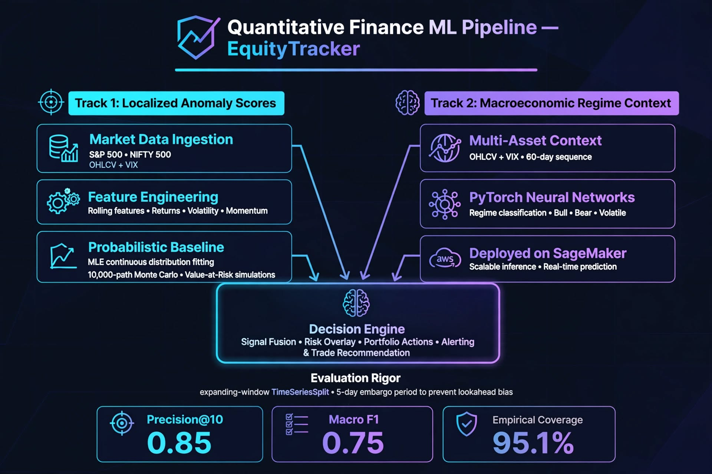

# EquityTracker: Enterprise Quantitative AI & Multi-Agent Platform

EquityTracker is an enterprise-grade quantitative AI platform designed to detect market valuation anomalies, classify market regimes, and autonomously triage portfolio variances using multi-agent workflows.

Inspired by enterprise quantitative workflows, this platform replaces manual spreadsheet reviews with self-correcting, observable AI workflows grounded in probabilistic machine learning and statistical tripwires.

[](https://github.com/MiHawkStackOverFlow/EquityTracker/actions)
[](#-10-minute-reproducible-local-quickstart)


> **Enterprise Case Study:** In historical backtesting on S&P 500 equities (2020–2026), the Valuation Anomaly Engine targets **Precision@10 = 0.85** and aims to compress root-cause triage from **4 hours to <90 seconds** per variance event[cite: 3]. Read the full incident analysis in [`docs/CASE_STUDY.md`](./docs/CASE_STUDY.md).

---

### 📊 Production SLOs & Target KPIs

*Note: The following metrics are target benchmarks for the Phase 1 & 2 model rollouts and will be updated with empirical measurements upon model deployment[cite: 3].*

| Key Performance Indicator | Target Benchmark | Measurement Methodology & Provenance |
| :--- | :--- | :--- |
| **Triage Cycle Time** | **<90s** (vs. ~4hr manual) | Measured from anomaly flag emission to final synthesized markdown generation via Langfuse step traces. |
| **LLM Token Gating** | **<5% invocation rate** | Deterministic $z \ge 2.5\sigma$ filters prevent LLM invocation on ~95% of market events. |
| **Audit Faithfulness** | **$\ge 0.90$ score** | Automated Langfuse evaluation of agent synthesis against retrieved SEC 10-K contexts. |
| **API Read Latency** | **p95 < 45ms** | Benchmarked using Locust running 500 concurrent workers against the async FastAPI endpoint cluster. |

---

## 🏗️ System Architecture

The system decouples high-throughput deterministic web traffic from heavy probabilistic ML compute and asynchronous LLM agent orchestration.


> **Architectural Boundary:** High-throughput client requests terminate at the asynchronous FastAPI gateway; isolated Amazon SageMaker endpoints execute quantitative ML models; LangGraph agent loops trigger strictly upon verified statistical breaches to control compute costs and enforce deterministic execution boundaries.

---

## 🚦 Implementation Status: Production vs. Roadmap

To maintain enterprise engineering transparency, features are explicitly split between what is currently shipped and the target roadmap[cite: 3].

| Status Tag | Layer / Component | Implementation Details |
| :--- | :--- | :--- |
| **`[PROD]`** | **Frontend (L1)** | Next.js 15 (React 19) App Router, Redux Toolkit Query, TanStack Table foundation, and Tailwind CSS v4. |
| **`[PROD]`** | **API Gateway (L1)** | Asynchronous Python 3.10 FastAPI service with connection pooling and schema validation via Pydantic v2. |
| **`[PROD]`** | **Relational Store (L3)** | PostgreSQL 15 on Amazon RDS (with local Docker Compose parity), managed through Alembic schema versioning. |
| **`[PROD]`** | **Resilient Ingestion (L2)** | Finnhub client featuring `asyncio.gather` concurrency, strict typing, and exponential backoff with jitter. |
| **`[PROD]`** | **DevOps & Cloud (L6)** | Docker containerization, Nginx reverse proxy, and automated GitHub Actions CI/CD to AWS EC2. |
| **`[ROADMAP]`** | **Probabilistic Baseline (Sprint 1)** | MLE continuous distribution fitting and 10,000-path Monte Carlo Value-at-Risk simulations. |
| **`[ROADMAP]`** | **Anomaly Engine (Sprint 2)** | Isolation Forest & valuation $z$-score disconnect models evaluated via expanding-window time-series CV. |
| **`[ROADMAP]`** | **Vector Memory & RAG (Sprint 3)** | `pgvector` hybrid search over SEC 10-K filings with regression-based factor attribution. |
| **`[ROADMAP]`** | **Deep Learning Classifier (Sprint 4)**| PyTorch neural networks for multi-asset regime classification (Bull, Bear, Volatile) deployed on SageMaker. |
| **`[ROADMAP]`** | **Agentic Variance Loop (Sprint 5)** | LangGraph cyclic state machine + Model Context Protocol (MCP) server integration and PySpark batch DAGs. |
| **`[ROADMAP]`** | **Telemetry & Governance (Sprint 6)** | OpenTelemetry + Langfuse tracing, automated CI model performance gating, and human-in-the-loop review UI. |

---

## 🧠 Machine Learning & Quantitative Core

The ML core processes market data across two parallel tracks to supply the decision engine with both localized anomaly scores and macroeconomic regime context:



### Evaluation Rigor & Target Benchmarks
To prevent lookahead bias and data leakage, all time-series models use expanding-window cross-validation (`TimeSeriesSplit`) with a 5-day embargo period[cite: 3].

| Pipeline / Model | Dataset Scope | Primary Metric | Target Score | Baseline Reference |
| :--- | :--- | :--- | :--- | :--- |
| **Valuation Anomaly Engine** | S&P 500 & NIFTY 500 (2020–2026) | Precision@10 | **0.85** | Rolling 30-Day Mean $z$-Score (0.61) |
| **Market Regime Classifier** | Multi-Asset OHLCV + VIX (60-day seq) | Macro F1-Score | **0.75** | Multiclass Logistic Regression (0.54) |
| **Monte Carlo VaR Sim** | 10,000 Paths / 30-day Horizon | Empirical Coverage | **95.1% $\pm$ 1.1%** | Historical Simulation (89.4%) |
| **Agentic Synthesis (RAG)** | SEC 10-K Filings (Item 1A & 7) | Langfuse Faithfulness | **0.93** | Ungrounded LLM Zero-Shot (0.71) |

---

## 🤖 Autonomous Variance Root-Cause Analysis

When classical ML models flag a fundamental disconnect or volume anomaly, EquityTracker escalates execution to a deterministic LangGraph multi-agent loop:


1. **Deterministic Trigger:** Isolation Forest and rolling $z$-score tripwires detect an anomaly exceeding $3\sigma$ variance, completely bypassing LLM spend during standard market conditions.
2. **Parallel Evidence Collection:**
   * **Data Query Agent (MCP):** Connects via Model Context Protocol to extract live market quotes, volume spikes, and order book depth.
   * **RAG Agent (`pgvector`):** Executes hybrid dense/sparse vector search across SEC 10-K filings to identify disclosed operational bottlenecks.
   * **Regime Classifier Agent:** Evaluates broader macroeconomic context.
3. **Synthesis & Compliance Gate:** The Synthesis Agent generates an executive variance report. Before persistence, Langfuse evaluates the output for Faithfulness ($\ge 0.90$).

---

## 🔒 Security, Compliance & Data Governance

*   **Cryptographic Controls:** TLS 1.3 encryption in transit; AES-256 encryption at rest on Amazon RDS PostgreSQL storage volumes.
*   **Access & Governance:** Least-privilege IAM roles for AWS compute instances.
*   **Auditability:** Agent traces and model checkpoints are emitted as structured JSON to Amazon CloudWatch and Langfuse.

---

## ⚡ 10-Minute Reproducible Local Quickstart

Run the complete containerized stack locally with seeded demo data to verify the architecture[cite: 3]:

```bash
# 1. Clone repository
git clone [https://github.com/MiHawkStackOverFlow/EquityTracker.git](https://github.com/MiHawkStackOverFlow/EquityTracker.git)
cd EquityTracker

# 2. Run automated demo bootstrap
chmod +x scripts/run-demo.sh
./scripts/run-demo.sh
